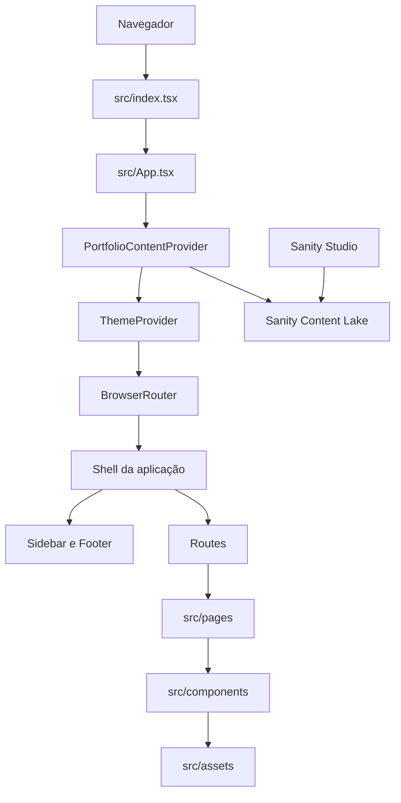

# My Portfolio

SPA do portfólio pessoal de Helder, construída com React e publicada na Vercel.

Este repositório é **IA-first**: o contexto técnico, os comandos reproduzíveis e os critérios de conclusão ficam documentados para que pessoas e agentes de IA consigam trabalhar com segurança, sem depender de conhecimento implícito do ambiente.

## Início rápido para agentes

Antes de alterar qualquer arquivo:

1. Leia [`AGENTS.md`](./AGENTS.md). Ele é a fonte de verdade para regras de execução.
2. Consulte `package.json`, os arquivos relacionados à tarefa e `git status`.
3. Execute Node.js, npm, testes e builds somente por Docker.
4. Preserve mudanças existentes e mantenha o menor diff completo possível.
5. Não faça commit, push, deploy ou alterações externas sem solicitação explícita.
6. Use `$publish` para revisar, criar commits convencionais e enviar uma branch sem atribuir autoria à IA.
7. Use `$suggest-pr` para gerar título e descrição completos sem criar a pull request.

Em caso de conflito, use esta ordem de precedência:

1. instrução explícita do usuário;
2. `AGENTS.md`;
3. configurações executáveis do repositório;
4. este README.

## Objetivo do produto

O site apresenta informações pessoais e profissionais por meio de uma SPA com as seguintes rotas:

| Rota | Conteúdo |
| --- | --- |
| `/` | Vinheta de entrada |
| `/home` | Página inicial |
| `/about` | Apresentação pessoal |
| `/academic` | Formação acadêmica |
| `/professional` | Experiência profissional |
| `/projects` | Projetos |
| `/certifications` | Certificações |
| `/contact` | Contatos e redes sociais |

O conteúdo público é administrado pelo Sanity Studio e lido diretamente do Content Lake. Não há API própria nem autenticação no bundle da SPA; o acesso de edição usa a conta autorizada no projeto Sanity.

## Stack e restrições

| Área | Tecnologia |
| --- | --- |
| Runtime | Node.js 24 |
| Interface | React 18 |
| Linguagem | TypeScript 4.9 em modo estrito |
| Build | Create React App 5 / `react-scripts` |
| Rotas | React Router 6 |
| Estilos | Tailwind CSS 3 e CSS existente |
| Testes | Jest e Testing Library |
| Animações | CSS com suporte a `prefers-reduced-motion` |
| Ambiente | Docker Compose |
| Hospedagem | Vercel |
| CMS | Sanity Content Lake e Studio |

Restrições arquiteturais importantes:

- Não executar `npm run eject`.
- Não migrar CRA, Tailwind ou a estratégia de estilos sem solicitação específica.
- Não adicionar dependências quando a plataforma ou uma dependência existente for suficiente.
- Não instalar Node.js, npm ou dependências do projeto diretamente no host.
- Preservar a identidade visual e o comportamento, salvo quando a tarefa pedir alterações.

## Mapa do repositório

```text
.
├── .agents/skills/          # Skills locais e versionados do Codex
├── public/                  # Arquivos estáticos e HTML base
├── src/
│   ├── assets/              # Imagens usadas pela interface
│   ├── components/          # Componentes compartilhados
│   ├── content/             # Tipos, fallback local e cliente de conteúdo
│   ├── context/             # Estado compartilhado de tema e conteúdo
│   ├── pages/               # Conteúdo das rotas
│   ├── App.tsx              # Roteamento e estrutura principal
│   ├── App.test.tsx         # Teste de entrada da aplicação
│   └── index.tsx            # Bootstrap do React
├── studio/                  # Sanity Studio, schemas e carga inicial
├── AGENTS.md                # Regras obrigatórias para agentes
├── Dockerfile               # Imagem Node.js 24 sem usuário privilegiado
├── docker-compose.yml       # Ambiente de desenvolvimento
├── package.json             # Scripts, versões diretas e runtime
├── tailwind.config.js       # Configuração do Tailwind
└── tsconfig.json            # Configuração TypeScript estrita
```

## Arquitetura da aplicação

A aplicação usa uma arquitetura SPA executada no navegador. Não há camada de servidor nem API própria: o conteúdo público é consultado no dataset Sanity e, se a configuração ou a consulta falhar, a interface preserva o conteúdo local de fallback. Recursos visuais locais continuam empacotados a partir de `src/assets/` ou servidos diretamente por `public/`.



### Responsabilidades por camada

| Camada | Responsabilidade |
| --- | --- |
| Bootstrap | `src/index.tsx` cria a raiz React, habilita `StrictMode`, carrega o CSS gerado pelo Tailwind e inicia `App`. |
| Composição | `src/App.tsx` monta os providers de conteúdo e tema, o roteador e o shell compartilhado pelas rotas internas. |
| Navegação | O React Router relaciona cada URL a uma página. `Sidebar` usa `NavLink`, enquanto `Footer` e a própria sidebar formam a estrutura persistente fora da vinheta inicial. |
| Estado compartilhado | `src/context/ThemeContext.tsx` controla o tema claro ou escuro e persiste a escolha em `localStorage`. `PortfolioContentContext.tsx` carrega o conteúdo remoto e mantém o fallback local durante a consulta ou em caso de falha. |
| Páginas | `src/pages/` organiza o conteúdo por rota e compõe os componentes reutilizáveis necessários a cada seção. |
| Componentes | `src/components/` concentra navegação, tema, rodapé, vinheta, estrutura de página, cards, abas, skills e timeline semântica. |
| Apresentação | `tailwind.config.js` expõe cores semânticas baseadas em variáveis CSS. `src/tailwind.css` define os tokens dos dois temas, estilos base e primitives compartilhadas; os componentes completam o layout com classes utilitárias. |
| Conteúdo e recursos | `src/content/` concentra tipos, fallback e consulta GROQ. O Studio isolado em `studio/` concentra schemas e edição. Imagens importadas de `src/assets/` entram no bundle; arquivos de `public/` são copiados sem processamento. |

### Fluxo de navegação e renderização

1. O navegador carrega `public/index.html`, e o bundle inicia a aplicação por `src/index.tsx`.
2. `App` disponibiliza o tema visual, cria o `BrowserRouter` e monta o shell responsivo.
3. O shell observa `location.pathname` e renderiza a rota correspondente com uma transição curta de entrada.
4. A rota `/` exibe somente `Vinheta`; nas demais rotas, sidebar e footer permanecem no shell ao redor do conteúdo.
5. O provider consulta o Sanity uma vez e distribui o conteúdo para as páginas; enquanto isso, ou se a consulta falhar, usa o conteúdo local de fallback.

### Limites arquiteturais atuais

- O roteamento depende da configuração da hospedagem para redirecionar URLs da SPA a `index.html`.
- O dataset contém apenas conteúdo destinado à exibição pública. Tokens de escrita e credenciais do Studio nunca devem ser enviados ao frontend.
- Os tokens de tema ficam centralizados no CSS, enquanto estrutura, responsividade e estados de componentes usam utilitários Tailwind no TSX.
- Como o conteúdo é renderizado no cliente pelo CRA, metadados específicos por rota e pré-renderização não fazem parte da arquitetura atual.

## Ambiente Docker-first

O único requisito local é Docker com o plugin Compose. O host não precisa de Node.js nem npm.

Suba o ambiente de desenvolvimento:

```bash
docker compose up --build
```

A aplicação ficará disponível em [http://localhost:3000](http://localhost:3000).

Encerre o ambiente preservando o volume de dependências:

```bash
docker compose down
```

O código-fonte é montado em `/app`, enquanto `node_modules` permanece isolado no volume nomeado `node_modules`.

### Conteúdo com Sanity

Copie `.env.example` para `.env.local` e informe o projeto e o dataset públicos:

```dotenv
REACT_APP_SANITY_PROJECT_ID=r8m8smdo
REACT_APP_SANITY_DATASET=production
```

Esses identificadores não são segredos. Não adicione tokens Sanity a variáveis `REACT_APP_*`, pois o CRA as incorpora ao bundle público.

Instale e execute o Studio isolado do React 18 da aplicação:

```bash
docker compose run --rm --user root app sh -lc 'cd studio && npm install'
docker compose run --rm --user root -p 3333:3333 app sh -lc 'cd studio && npm run dev -- --host 0.0.0.0'
```

O Studio publicado fica disponível em [thehprogrammer-portfolio.sanity.studio](https://thehprogrammer-portfolio.sanity.studio/), com autenticação e autorização gerenciadas pelo Sanity. O comando de desenvolvimento acima mantém a versão local em [http://localhost:3333](http://localhost:3333).

A carga inicial exige login no projeto e deve ser executada somente quando for necessário restaurar o conteúdo-base:

```bash
docker compose run --rm app sh -lc 'cd studio && npm run seed'
```

### Comandos dentro do container

Verificação TypeScript:

```bash
docker compose run --rm app npx tsc --noEmit
```

Testes não interativos:

```bash
docker compose run --rm -e CI=true app npm test -- --watchAll=false
```

Build de produção:

```bash
docker compose run --rm app npm run build
```

Auditoria de dependências:

```bash
docker compose run --rm app npm audit
```

Após uma mudança em `package.json` ou `package-lock.json`, reconstrua a imagem:

```bash
docker compose build
```

Comandos de manutenção que precisem escrever no bind mount podem exigir `--user root` por causa do mapeamento de usuários do daemon. Isso deve ser pontual; a aplicação continua executando como o usuário não privilegiado `node`.

## Fluxo recomendado para mudanças

1. Defina o comportamento esperado e a evidência atual.
2. Inspecione somente os arquivos relacionados.
3. Registre um plano curto quando mais de um arquivo precisar mudar.
4. Implemente a menor solução completa.
5. Execute as validações proporcionais ao risco dentro do container.
6. Revise `git diff`, `git diff --check` e `git status`.
7. Relate arquivos alterados, comandos executados, falhas e riscos restantes.

### Matriz de validação

| Tipo de mudança | Validação mínima |
| --- | --- |
| Documentação | `git diff --check` |
| TypeScript ou React | TypeScript e testes relacionados |
| Comportamento | TypeScript, testes e verificação do fluxo |
| Dependências ou configuração | Instalação limpa, auditoria e build |
| Produção, bundle ou runtime | Build de produção |
| Interface | Navegação por teclado e verificação visual quando disponível |

Não declare uma validação como aprovada sem executar o comando correspondente.

## Verificação visual com IA

Quando a interface ou a configuração do servidor mudar:

1. inicie a aplicação com Docker Compose;
2. execute `agent-browser` e Chromium em um container descartável;
3. verifique carregamento, conteúdo visível, error overlay e console;
4. teste pelo menos o fluxo principal e as rotas afetadas;
5. capture uma imagem quando ela ajudar a comprovar o resultado;
6. encerre o navegador e os containers temporários.

Não adicione navegador ou ferramentas de automação às dependências de produção apenas para realizar essa verificação.

## Qualidade e segurança

- Use componentes funcionais e TypeScript estrito; não introduza `any` sem justificativa.
- Mantenha HTML semântico, nomes acessíveis, foco visível e navegação por teclado.
- Respeite `prefers-reduced-motion` ao alterar animações.
- Nunca inclua credenciais, tokens ou dados privados no bundle.
- Trate dependências e conteúdo externo como não confiáveis.
- Evite correções automáticas destrutivas, especialmente `npm audit fix --force`.
- Não altere arquivos gerados diretamente; atualize a fonte correspondente.

## Estado conhecido

- O projeto usa Node.js 24 no Docker e em `engines.node`.
- O Create React App 5 não recebe manutenção e mantém dependências transitivas obsoletas.
- A auditoria atual possui vulnerabilidades transitivas sem correção compatível dentro do CRA 5.
- `npm audit fix --force` tenta substituir `react-scripts` por uma versão inválida e não deve ser usado.
- Node.js 24 emite `DEP0176` a partir de `react-dev-utils`; o build continua funcional.
- Não há scripts dedicados de lint ou formatter. Siga o estilo existente.

A remoção completa dessa dívida exige uma migração planejada para um toolchain mantido. Ela não deve ser misturada com tarefas comuns de manutenção.

## Deploy

O projeto é hospedado na Vercel em:

- [thehprogrammer-portfolio.vercel.app](https://thehprogrammer-portfolio.vercel.app)

O `package.json` fixa Node.js 24 para os próximos builds. Deploys e mudanças na configuração externa da Vercel exigem autorização explícita e devem ser validados primeiro em preview.

## Critério de conclusão

Uma tarefa está concluída quando:

- o comportamento solicitado foi implementado;
- o diff está limitado ao escopo;
- as validações relevantes foram executadas e relatadas;
- falhas preexistentes foram separadas de regressões;
- riscos e próximos passos foram registrados;
- nenhuma ação externa não autorizada foi realizada.
