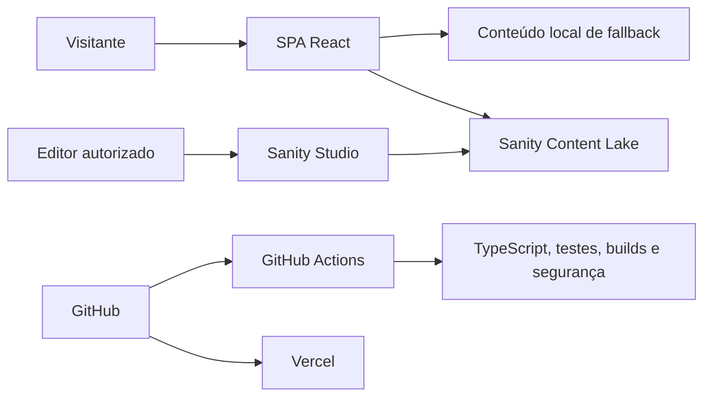

# Visão geral da arquitetura

## Limites do sistema

O produto possui duas aplicações web independentes:

- a SPA pública em React 18 e Create React App 5, publicada na Vercel;
- o Sanity Studio em `studio/`, usado por pessoas autorizadas para editar conteúdo público.

Não existe API própria. A SPA consulta o Content Lake diretamente com identificadores públicos e
mantém conteúdo local como fallback. Tokens de escrita nunca podem usar o prefixo `REACT_APP_`, pois
essas variáveis são incorporadas ao bundle entregue ao navegador.

## Rotas públicas

| Rota              | Responsabilidade                                      |
| ----------------- | ----------------------------------------------------- |
| `/`               | Exibir a vinheta de entrada sem o shell de navegação. |
| `/home`           | Apresentar a visão inicial do portfólio.              |
| `/about`          | Exibir apresentação pessoal.                          |
| `/academic`       | Exibir formação acadêmica.                            |
| `/professional`   | Exibir experiência profissional.                      |
| `/projects`       | Exibir projetos.                                      |
| `/certifications` | Exibir certificações.                                 |
| `/contact`        | Exibir contatos e redes sociais.                      |

## Responsabilidades

| Área              | Fonte principal                                           | Responsabilidade                                             |
| ----------------- | --------------------------------------------------------- | ------------------------------------------------------------ |
| Bootstrap e rotas | `src/index.tsx`, `src/App.tsx`                            | Providers, roteador e shell da SPA.                          |
| Apresentação      | `src/components/`, `src/pages/`, `src/tailwind.css`       | Interface, semântica, responsividade e temas.                |
| Conteúdo          | `src/content/`, `src/context/PortfolioContentContext.tsx` | Tipos, fallback, consulta remota e distribuição do conteúdo. |
| Edição            | `studio/`                                                 | Schemas, estrutura editorial e carga inicial autorizada.     |
| Automação         | `.github/`                                                | Qualidade e segurança sem executar deploy.                   |
| Orientação de IA  | `AGENTS.md`, `.codex/`, `.agents/skills/`                 | Regras, contexto e workflows reutilizáveis.                  |

## Fluxo de renderização

1. `public/index.html` carrega o bundle iniciado por `src/index.tsx`.
2. `App` monta os providers de conteúdo e tema, o `BrowserRouter` e o shell compartilhado.
3. A rota `/` renderiza somente a vinheta; as demais mantêm sidebar e footer ao redor da página.
4. `PortfolioContentProvider` consulta o Sanity uma vez e distribui o resultado para as páginas.
5. Enquanto a consulta está pendente, sem configuração ou em falha, o conteúdo local permanece ativo.

## Contratos que devem ser preservados

- URLs externas vindas do CMS passam pela validação existente antes de renderizar links.
- Falha ou ausência de configuração do Sanity não torna as rotas públicas indisponíveis.
- A hospedagem deve redirecionar rotas da SPA para `index.html`.
- Mudanças de schema devem permanecer compatíveis com o fallback e com as consultas do frontend.
- Builds e automações não podem depender de credenciais de produção.
